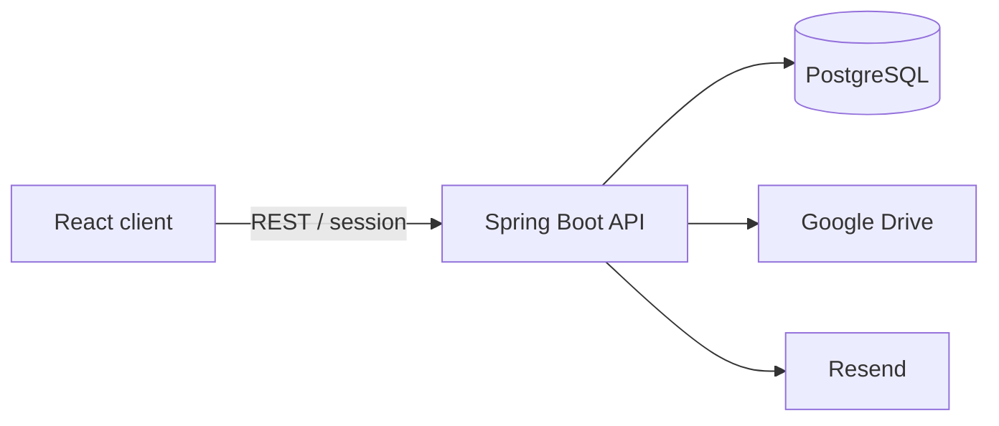

<p align="center">
  
</p>

<h1 align="center">DriveManager</h1>

<p align="center">
  A self-hosted control layer for personal files, links, collections, and cloud storage.
</p>

<p align="center">
  <a href="https://github.com/phuxp17/DriveManager/actions/workflows/deploy.yml"></a>
  
  
  
  
</p>

<p align="center">
  <a href="#overview">Overview</a> ·
  <a href="#features">Features</a> ·
  <a href="#architecture">Architecture</a> ·
  <a href="#quick-start">Quick start</a> ·
  <a href="#production">Production</a>
</p>

<p align="center"><a href="README.vi.md">Đọc bằng tiếng Việt</a></p>

## Overview

DriveManager brings scattered files, bookmarks, and documents into one searchable personal library. PostgreSQL stores the organization layer—metadata, collections, tags, sharing, and user state—while providers such as Google Drive keep the file binaries.

This separation keeps storage portable without giving up a consistent interface for organizing and finding content.

## Features

| Area | Highlights |
|---|---|
| Secure access | Session authentication, CSRF protection, rate limiting, and mandatory email verification through Resend |
| Personal library | Links, files, nested collections, colored tags, search, favorites, archive, and trash |
| Cloud storage | Google Drive OAuth, encrypted refresh tokens, direct uploads, and existing-file import |
| Collaboration | Read-only sharing, invitation lifecycle, and personal contacts |
| Reliable updates | Optimistic concurrency control with explicit conflict handling |

## Architecture



| Layer | Technology |
|---|---|
| Backend | Java 21, Spring Boot 3.5, Spring Security, JPA, Flyway |
| Frontend | React 18, TypeScript, Vite 6, TanStack Query, Radix UI |
| Data | PostgreSQL 17 |
| Delivery | Docker Compose, Nginx, GHCR, GitHub Actions |

## Quick start

Requirements: Java 21, Maven, Node.js 22, and Docker.

```bash
git clone https://github.com/phuxp17/DriveManager.git
cd DriveManager
export POSTGRES_PASSWORD=storage_hub
export RESEND_API_KEY=replace_with_your_resend_key
docker compose up -d postgres
```

Start the API:

```bash
cd backend
mvn spring-boot:run -Dspring-boot.run.profiles=local
```

Start the web app in another terminal:

```bash
cd frontend
npm ci
npm run dev
```

Open [http://localhost:3000](http://localhost:3000). Registration requires a valid Resend key because email verification is enforced in every environment.

## Optional integrations

- **Resend:** verification email delivery and activation links.
- **Google Drive:** OAuth client credentials and an authorized callback URI are required only when Drive integration is enabled.
- **Credential encryption:** Google refresh tokens are encrypted with versioned AES-256-GCM keys.

All local and production secrets belong in ignored environment files, GitHub Secrets, or the deployment host—never in Git.

## Test

```bash
cd backend && mvn verify
cd frontend && npm test && npm run build
```

## Production

The `main` workflow tests both applications, publishes commit-addressed images to GHCR, and deploys the exact commit to a Docker Compose host. Health checks gate completion and the deploy script rolls back to the previous image tag when startup fails.

## License

Released under the [MIT License](LICENSE).
