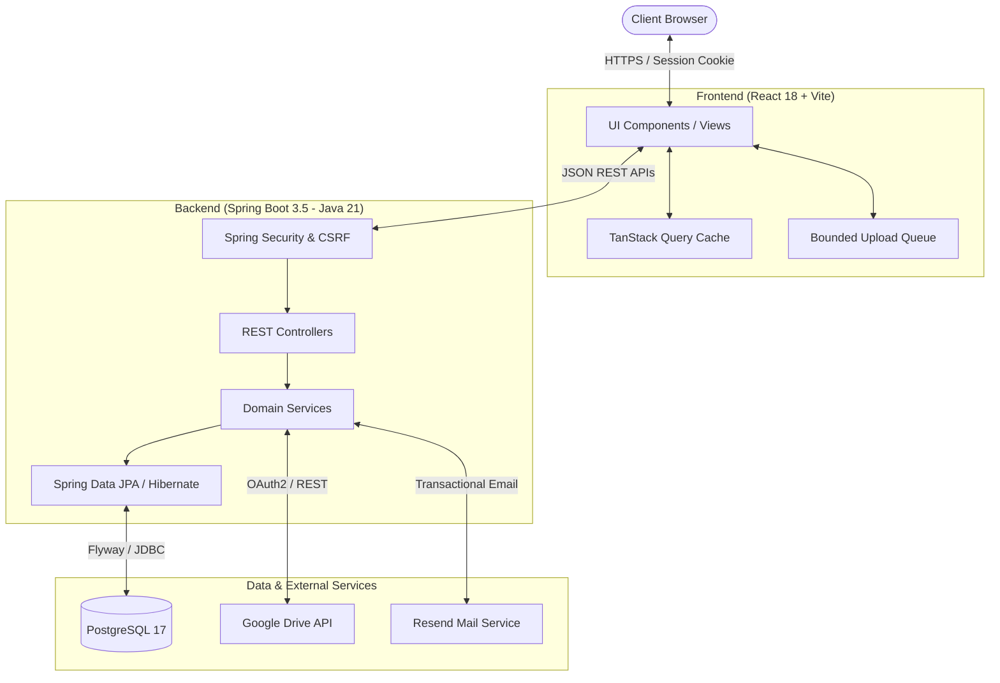

# 🚀 DriveManager

<div align="center">

[](https://openjdk.org/)
[](https://spring.io/projects/spring-boot)
[](https://react.dev/)
[](https://www.typescriptlang.org/)
[](https://vitejs.dev/)
[](https://www.postgresql.org/)
[](https://www.docker.com/)
[](LICENSE)

**A secure, modern personal cloud storage hub and digital library management platform.**  
*Unified file and link management with Google Drive integration, multi-tier nested collections, and granular access control.*

---

[ 🇬🇧 English ](README.md) &nbsp;•&nbsp; [ 🇻🇳 Tiếng Việt ](README.vi.md)

</div>

---

## 📖 Table of Contents

- [Overview](#-overview)
- [Key Features](#-key-features)
- [System Architecture](#-system-architecture)
- [Tech Stack](#-tech-stack)
- [Project Structure](#-project-structure)
- [Prerequisites](#-prerequisites)
- [Quick Start](#-quick-start)
  - [1. Environment Setup](#1-environment-setup)
  - [2. Start PostgreSQL Database](#2-start-postgresql-database)
  - [3. Run the Backend](#3-run-the-backend)
  - [4. Run the Frontend](#4-run-the-frontend)
- [Environment Variables](#-environment-variables)
- [REST API Reference](#-rest-api-reference)
- [Security & Concurrency](#-security--concurrency)
- [Testing](#-testing)
- [Production Deployment](#-production-deployment)
- [License](#-license)

---

## 🌟 Overview

**DriveManager** is an enterprise-ready personal storage aggregator designed to bring order to fragmented cloud files, bookmarks, and documents. 

Rather than duplicating cloud storage infrastructure, DriveManager acts as a high-performance **metadata management engine**:
- **PostgreSQL** stores relational metadata, nested taxonomy, tags, and JDBC session state.
- **Configured Storage Providers** (such as Google Drive) store the actual physical file binaries.
- **Spring Boot 3.5 & React 18** provide a responsive, real-time management experience with optimistic concurrency control and strict session security.

---

## ✨ Key Features

| Category | Highlights |
| :--- | :--- |
| 🛡️ **Authentication & Security** | Cookie-based session authentication with `HttpOnly` and `SameSite=Lax`. In-memory rotating CSRF token with automatic refresh on `403`. Email verification powered by Resend API. Automatic query cache purge on logout. |
| ⚡ **Optimistic Locking (OCC)** | Version-tracked item mutations using `expectedVersion`. Robust `409 VERSION_CONFLICT` resolution preserving user drafts while previewing upstream changes. |
| 🗂️ **Hierarchical Collections** | Recursive folder tree supporting up to 10 nested levels with lazy-loading child nodes. Soft deletion and batch item restoration. |
| 🏷️ **Dynamic Tag Taxonomy** | Custom colored tags (Hex codes), item multi-tagging, and tag merging (`merge tags`) with automatic reference re-mapping. |
| ☁️ **Cloud Storage Integration** | Seamless Google Drive integration via OAuth2 web flow (`connect`, `reconnect`, `disconnect`). Up to 50MB direct uploads. Import existing Drive files by ID or URL. |
| 🚀 **Upload Queue Engine** | Client-side background upload manager with strict concurrency control (maximum 2 simultaneous uploads). |
| 🤝 **Sharing & Access Control** | Granular read-only (`VIEW`) permissions for items and collections. Full invitation lifecycle (Accept, Decline, Leave, Revoke) and personal contact book. |
| 🖥️ **Modern Explorer UI** | 8 smart filter views (*Inbox*, *Favorites*, *Recent*, *Trash*, etc.), List/Grid view switcher with persistent user preferences, debounced search, and server-side pagination. |

---

## 🏗️ System Architecture



---

## 🛠️ Tech Stack

### Backend
- **Runtime & Language**: Java 21 (Temurin / OpenJDK)
- **Framework**: Spring Boot 3.5.14
- **Security**: Spring Security 6 (Session-based, In-Memory CSRF Token Repository, OAuth2 Resource Server)
- **Persistence**: Spring Data JPA, Hibernate (Validation mode), Spring Session JDBC
- **Database Migrations**: Flyway Core & Flyway PostgreSQL
- **Monitoring & Metrics**: Spring Boot Actuator
- **Integrations**: Google API Client (Drive v3), Resend SDK / REST API
- **Testing**: JUnit 5, Mockito, Spring Security Test, Testcontainers (PostgreSQL 17)

### Frontend
- **Framework & Tooling**: React 18.3, TypeScript 5.7, Vite 6.2
- **State & Data Fetching**: TanStack React Query v5
- **Routing**: React Router DOM v6
- **UI Primitives & Icons**: Radix UI Primitives, Lucide React
- **Testing**: Vitest, React Testing Library, JSDOM

### Infrastructure
- **Containerization**: Docker & Docker Compose (PostgreSQL 17 Alpine)
- **Database Engine**: PostgreSQL 17

---

## 📁 Project Structure

```text
DriveManager/
├── backend/                        # Spring Boot 3.5 Backend (Java 21)
│   ├── src/
│   │   ├── main/
│   │   │   ├── java/com/drivemanager/storagehub/
│   │   │   │   ├── auth/           # Authentication, Sessions, CSRF, Resend Email
│   │   │   │   ├── collection/     # Nested collections & item binding
│   │   │   │   ├── common/         # Global exceptions, validation, advice
│   │   │   │   ├── contact/        # User address book & aliases
│   │   │   │   ├── item/           # File, link, and metadata management
│   │   │   │   ├── sharing/        # Access controls & invitations
│   │   │   │   ├── storage/        # Cloud providers (Google Drive integration)
│   │   │   │   ├── tag/            # Tag taxonomy & color management
│   │   │   │   └── user/           # User entity & credentials
│   │   │   └── resources/
│   │   │       ├── application.yml # Base configuration
│   │   │       ├── application-local.yml
│   │   │       └── db/migration/   # Flyway SQL migrations
│   │   └── test/                   # Unit & Testcontainers integration tests
│   ├── pom.xml                     # Maven build configuration
│   ├── run-local.ps1               # Local runner script (PowerShell)
│   └── test-local.ps1              # Isolated test runner script
├── frontend/                       # React 18 + TypeScript + Vite Frontend
│   ├── src/
│   │   ├── api/                    # API client layer with CSRF rotation
│   │   ├── components/             # Reusable UI widgets & Radix dialogs
│   │   ├── context/                # Auth & app-wide state providers
│   │   ├── hooks/                  # Custom hooks (e.g., useUploadQueue)
│   │   ├── pages/                  # Router page views & dashboard
│   │   └── types/                  # TypeScript domain models
│   ├── package.json                # NPM configuration
│   ├── vite.config.ts              # Vite bundler & API proxy configuration
│   └── vitest.config.ts            # Frontend test configuration
├── compose.yml                     # Docker Compose for PostgreSQL 17
├── .env.example                    # Template environment variables
└── README.md                       # Project documentation
```

---

## 📋 Prerequisites

Before running the application, ensure the following software is installed on your machine:

- **Java Development Kit (JDK)**: Version 21
- **Apache Maven**: Version 3.9+
- **Node.js**: Version 20+ (with `npm`)
- **Docker & Docker Desktop**: For running PostgreSQL 17 (or a local PostgreSQL 17 instance)

---

## 🚀 Quick Start

### 1. Environment Setup

Copy `.env.example` to create your local `.env` file:

```bash
# Linux / macOS / Git Bash
cp .env.example .env

# Windows PowerShell
Copy-Item .env.example .env
```

Open `.env` and fill in your custom values (e.g., `POSTGRES_PASSWORD`).

> [!IMPORTANT]
> Never commit `.env` containing production passwords or secret API keys to version control. The `.env` file is ignored by `.gitignore`.

### 2. Start PostgreSQL Database

You can run the managed PostgreSQL 17 container using Docker Compose:

```bash
docker compose up -d postgres
```

Verify that the database is healthy:

```bash
docker compose ps
```

*(Alternatively, you can point to an existing local PostgreSQL installation by adjusting `POSTGRES_PORT` and credentials in `.env`.)*

### 3. Run the Backend

#### Using PowerShell (Windows):
```powershell
powershell -NoProfile -File backend/run-local.ps1
```

#### Using Maven directly (Cross-platform):
```bash
cd backend
mvn spring-boot:run -Dspring-boot.run.profiles=local
```

Once started, verify that the backend health probe returns `UP`:
```bash
curl http://localhost:8080/actuator/health
# Response: {"status":"UP"}
```

### 4. Run the Frontend

In a separate terminal:

```bash
cd frontend
npm install
npm run dev
```

Open your browser and navigate to:
👉 **`http://localhost:3000`**

*(Requests made to `/api/*` are automatically proxied by Vite to the backend on `http://localhost:8080`.)*

---

## ⚙️ Environment Variables

The application is configured using environment variables defined in `.env`:

| Variable | Default Value | Description |
| :--- | :--- | :--- |
| `POSTGRES_DB` | `storage_hub` | Name of the PostgreSQL database |
| `POSTGRES_USER` | `storage_hub` | Database username |
| `POSTGRES_PASSWORD` | *(Required)* | Database user password |
| `POSTGRES_PORT` | `5432` | Exposed host port for PostgreSQL |
| `USE_EXTERNAL_TEST_DATABASE` | `false` | If `true`, tests run against an external PostgreSQL instance instead of Testcontainers |
| `TEST_DATABASE_URL` | `jdbc:postgresql://localhost:5432/storage_hub` | JDBC URL for isolated test schema |
| `TEST_DATABASE_USERNAME`| `storage_hub` | Test database username |
| `TEST_DATABASE_PASSWORD`| *(Empty)* | Test database password |
| `GOOGLE_CLIENT_ID` | *(Optional)* | Google Cloud OAuth 2.0 Web Client ID |
| `GOOGLE_CLIENT_SECRET` | *(Optional)* | Google Cloud OAuth 2.0 Web Client Secret |
| `GOOGLE_REDIRECT_URI` | `http://localhost:3000/app/connections/callback` | Authorized redirect URI configured in Google Console |
| `RESEND_API_KEY` | *(Optional)* | Resend API key for verification emails |
| `RESEND_FROM` | `DriveManager <onboarding@resend.dev>` | Outgoing email sender address |
| `APP_BASE_URL` | `http://localhost:8080` | Base URL of the backend application |
| `FRONTEND_URL` | `http://localhost:3000` | Base URL of the frontend application |

---

## 📡 REST API Reference

All backend APIs are prefixed with `/api/v1` and use standard HTTP response codes.

### Authentication & User (`/api/v1/auth`)
| Method | Endpoint | Description | Auth Required |
| :--- | :--- | :--- | :---: |
| `POST` | `/api/v1/auth/register` | Register a new account | ❌ |
| `POST` | `/api/v1/auth/login` | Log in and establish session cookie | ❌ |
| `GET` | `/api/v1/auth/verify?token=...` | Verify email address | ❌ |
| `GET` | `/api/v1/auth/me` | Fetch authenticated user profile | ✅ |
| `GET` | `/api/v1/auth/csrf` | Obtain current rotating CSRF token | ❌ |
| `POST` | `/api/v1/auth/logout` | Terminate session and invalidate cookies | ✅ |

### Items & Files (`/api/v1/items`)
| Method | Endpoint | Description | Auth Required |
| :--- | :--- | :--- | :---: |
| `GET` | `/api/v1/items` | List items with search, views, and pagination | ✅ |
| `POST` | `/api/v1/items` | Create a new link or note item | ✅ |
| `GET` | `/api/v1/items/{id}` | Get item metadata details | ✅ |
| `PATCH`| `/api/v1/items/{id}` | Update item (requires `expectedVersion`) | ✅ |
| `DELETE`| `/api/v1/items/{id}`| Soft-delete item (move to Trash) | ✅ |
| `POST` | `/api/v1/items/upload`| Upload file binary (up to 50MB) | ✅ |

### Collections (`/api/v1/collections`)
| Method | Endpoint | Description | Auth Required |
| :--- | :--- | :--- | :---: |
| `GET` | `/api/v1/collections` | Fetch root & nested collection hierarchy | ✅ |
| `POST` | `/api/v1/collections` | Create a new root or child collection | ✅ |
| `PATCH`| `/api/v1/collections/{id}`| Rename or move collection | ✅ |
| `DELETE`| `/api/v1/collections/{id}`| Soft delete collection | ✅ |
| `PUT` | `/api/v1/collections/{id}/items/{itemId}` | Assign item to collection | ✅ |

### Tags (`/api/v1/tags`)
| Method | Endpoint | Description | Auth Required |
| :--- | :--- | :--- | :---: |
| `GET` | `/api/v1/tags` | List all tags with item counts | ✅ |
| `POST` | `/api/v1/tags` | Create a new tag with Hex color code | ✅ |
| `POST` | `/api/v1/tags/merge` | Merge source tag into target tag | ✅ |
| `DELETE`| `/api/v1/tags/{id}` | Delete tag | ✅ |

### Cloud Storage Connections (`/api/v1/storage-connections`)
| Method | Endpoint | Description | Auth Required |
| :--- | :--- | :--- | :---: |
| `GET` | `/api/v1/storage-connections` | Check cloud providers connection state | ✅ |
| `POST` | `/api/v1/storage-connections/google/connect` | Authorize Google Drive via OAuth2 | ✅ |
| `POST` | `/api/v1/storage-connections/google/disconnect`| Disconnect Google Drive | ✅ |

### Sharing & Invitations (`/api/v1/shares`)
| Method | Endpoint | Description | Auth Required |
| :--- | :--- | :--- | :---: |
| `POST` | `/api/v1/shares` | Share item or collection with recipient email | ✅ |
| `GET` | `/api/v1/shares/incoming` | List incoming shared items/collections | ✅ |
| `POST` | `/api/v1/shares/{id}/accept` | Accept sharing invitation | ✅ |
| `POST` | `/api/v1/shares/{id}/decline`| Decline sharing invitation | ✅ |

---

## 🔒 Security & Concurrency

### Cookie-based Session & CSRF Protection
- Sessions are stored in PostgreSQL using **Spring Session JDBC**, surviving server restarts.
- Session cookies are protected with `HttpOnly` and `SameSite=Lax`.
- Mutation requests (`POST`, `PUT`, `PATCH`, `DELETE`) require a valid CSRF header fetched dynamically from `/api/v1/auth/csrf`.
- The frontend client automatically refreshes the CSRF token upon receiving an unexpected `403 Forbidden` response and retries the request.

### Optimistic Concurrency Control
```text
Client (Version: 2) ── PATCH (expectedVersion: 2) ──> Server (Current: 2) [OK -> Version: 3]
Client (Version: 2) ── PATCH (expectedVersion: 2) ──> Server (Current: 3) [409 CONFLICT]
```
When multiple clients attempt to modify the same resource simultaneously:
1. The backend rejects stale updates with a `409 Conflict (VERSION_CONFLICT)`.
2. The frontend catches the 409 error, preserves the user's active uncommitted draft, and offers a diff/reload option to prevent accidental data loss.

---

## 🧪 Testing

### Backend Tests
Integration tests run against isolated PostgreSQL environments via **Testcontainers**:

```bash
cd backend
mvn test
```

To run tests against an external PostgreSQL database (without requiring Docker):
```powershell
powershell -NoProfile -File backend/test-local.ps1
```

### Frontend Tests
Run unit and integration tests with **Vitest**:

```bash
cd frontend
npm run test
```

Run TypeScript validation without emitting files:
```bash
npm run lint
```

---

## 📦 Production Deployment

### 1. Build the Backend Executable JAR
```bash
cd backend
mvn clean package -DskipTests
```
The packaged artifact is produced at `backend/target/storage-hub-backend-0.0.1-SNAPSHOT.jar`. Run it with:
```bash
java -jar backend/target/storage-hub-backend-0.0.1-SNAPSHOT.jar
```

> [!NOTE]
> In production mode (without the `local` profile active), `SESSION_COOKIE_SECURE` defaults to `true`, requiring HTTPS for all web traffic.

### 2. Build Frontend Static Assets
```bash
cd frontend
npm run build
```
Optimized static files will be generated in `frontend/dist/`, ready to be served by Nginx, Caddy, or a CDN.

---

## 📄 License

This project is licensed under the **MIT License**. See the [LICENSE](LICENSE) file for more information.
