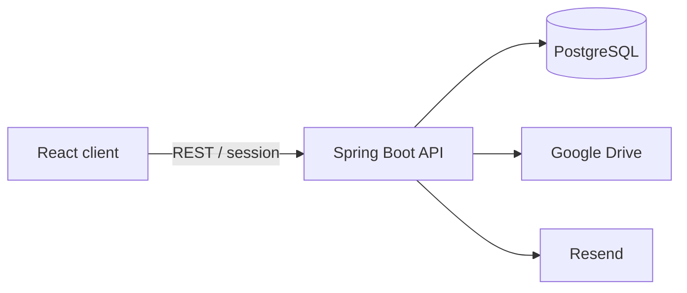

<p align="center">
  
</p>

<h1 align="center">DriveManager</h1>

<p align="center">
  Lớp quản lý self-hosted cho tệp cá nhân, liên kết, bộ sưu tập và lưu trữ đám mây.
</p>

<p align="center">
  <a href="https://github.com/phuxp17/DriveManager/actions/workflows/deploy.yml"></a>
  
  
  
  
</p>

<p align="center">
  <a href="#tổng-quan">Tổng quan</a> ·
  <a href="#tính-năng">Tính năng</a> ·
  <a href="#kiến-trúc">Kiến trúc</a> ·
  <a href="#chạy-nhanh">Chạy nhanh</a> ·
  <a href="#production">Production</a>
</p>

<p align="center"><a href="README.md">Read in English</a></p>

## Tổng quan

DriveManager tập hợp tệp, bookmark và tài liệu rời rạc thành một thư viện cá nhân có thể tìm kiếm. PostgreSQL lưu lớp tổ chức—metadata, bộ sưu tập, thẻ, chia sẻ và trạng thái người dùng—trong khi Google Drive hoặc nhà cung cấp khác giữ nội dung tệp.

Cách tách này giúp dữ liệu lưu trữ vẫn linh hoạt nhưng người dùng luôn có một giao diện thống nhất để sắp xếp và tìm nội dung.

## Tính năng

| Nhóm | Điểm nổi bật |
|---|---|
| Truy cập an toàn | Session authentication, CSRF, rate limiting và bắt buộc xác minh email qua Resend |
| Thư viện cá nhân | Liên kết, tệp, bộ sưu tập lồng nhau, thẻ màu, tìm kiếm, yêu thích, lưu trữ và thùng rác |
| Cloud storage | Google Drive OAuth, mã hóa refresh token, upload trực tiếp và import tệp sẵn có |
| Cộng tác | Chia sẻ chỉ đọc, vòng đời lời mời và danh bạ cá nhân |
| Cập nhật tin cậy | Optimistic concurrency control với xử lý xung đột rõ ràng |

## Kiến trúc



| Lớp | Công nghệ |
|---|---|
| Backend | Java 21, Spring Boot 3.5, Spring Security, JPA, Flyway |
| Frontend | React 18, TypeScript, Vite 6, TanStack Query, Radix UI |
| Dữ liệu | PostgreSQL 17 |
| Phân phối | Docker Compose, Nginx, GHCR, GitHub Actions |

## Chạy nhanh

Yêu cầu: Java 21, Maven, Node.js 22 và Docker.

```bash
git clone https://github.com/phuxp17/DriveManager.git
cd DriveManager
export POSTGRES_PASSWORD=storage_hub
export RESEND_API_KEY=thay_bang_resend_key_cua_ban
docker compose up -d postgres
```

Khởi động API:

```bash
cd backend
mvn spring-boot:run -Dspring-boot.run.profiles=local
```

Mở terminal khác để chạy frontend:

```bash
cd frontend
npm ci
npm run dev
```

Truy cập [http://localhost:3000](http://localhost:3000). Đăng ký cần Resend key hợp lệ vì xác minh email được áp dụng trong mọi môi trường.

## Tích hợp tùy chọn

- **Resend:** gửi email xác minh và liên kết kích hoạt.
- **Google Drive:** chỉ cần OAuth client và callback URI khi bật kết nối Drive.
- **Mã hóa credential:** refresh token Google được mã hóa bằng khóa AES-256-GCM có phiên bản.

Secret local và production phải nằm trong file môi trường được ignore, GitHub Secrets hoặc VPS—không đưa vào Git.

## Kiểm thử

```bash
cd backend && mvn verify
cd frontend && npm test && npm run build
```

## Production

Workflow trên nhánh `main` kiểm thử hai ứng dụng, phát hành image theo commit lên GHCR và triển khai đúng commit đó tới Docker Compose host. Health check quyết định trạng thái hoàn tất; script deploy tự quay lại image trước nếu phiên bản mới không khởi động được.

## Giấy phép

Phát hành theo [MIT License](LICENSE).
