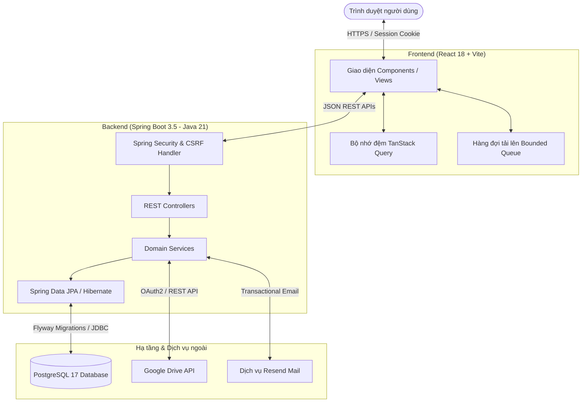

# 🚀 DriveManager

<div align="center">

[](https://openjdk.org/)
[](https://spring.io/projects/spring-boot)
[](https://react.dev/)
[](https://www.typescriptlang.org/)
[](https://vitejs.dev/)
[](https://www.postgresql.org/)
[](https://www.docker.com/)
[](LICENSE)

**Nền tảng quản lý thư viện số và trung tâm lưu trữ đám mây cá nhân hiện đại, bảo mật cao.**  
*Hợp nhất quản lý tệp tin và liên kết cùng kết nối Google Drive, cấu trúc bộ sưu tập phân tầng sâu và phân quyền linh hoạt.*

---

[ 🇬🇧 English ](README.md) &nbsp;•&nbsp; [ 🇻🇳 Tiếng Việt ](README.vi.md)

</div>

---

## 📖 Mục lục

- [Tổng quan](#-tổng-quan)
- [Tính năng nổi bật](#-tính-năng-nổi-bật)
- [Kiến trúc hệ thống](#-kiến-trúc-hệ-thống)
- [Công nghệ sử dụng](#-công-nghệ-sử-dụng)
- [Cấu trúc dự án](#-cấu-trúc-dự-án)
- [Yêu cầu môi trường](#-yêu-cầu-môi-trường)
- [Hướng dẫn cài đặt & Khởi chạy](#-hướng-dẫn-cài-đặt--khởi-chạy)
  - [1. Thiết lập biến môi trường](#1-thiết-lập-biến-môi-trường)
  - [2. Khởi động PostgreSQL Database](#2-khởi-động-postgresql-database)
  - [3. Chạy Backend](#3-chạy-backend)
  - [4. Chạy Frontend](#4-chạy-frontend)
- [Bảng tham số môi trường (.env)](#-bảng-tham-số-môi-trường-env)
- [Danh mục REST API](#-danh-mục-rest-api)
- [Bảo mật & Kiểm soát tương tranh](#-bảo-mật--kiểm-soát-tương-tranh)
- [Kiểm thử (Testing)](#-kiểm-thử-testing)
- [Đóng gói & Triển khai Production](#-đóng-gói--triển-khai-production)
- [Giấy phép](#-giấy-phép)

---

## 🌟 Tổng quan

**DriveManager** là giải pháp trung tâm lưu trữ dữ liệu cá nhân chuẩn doanh nghiệp, giúp tập hợp và quản lý ngăn nắp các tệp tin lưu trữ phân mảnh trên đám mây, liên kết web (bookmarks) và ghi chú số.

Thay vì tự xây dựng hạ tầng lưu trữ tệp vật lý phức tạp, DriveManager đóng vai trò là một **công cụ quản lý siêu dữ liệu (Metadata Management Engine)** hiệu năng cao:
- **PostgreSQL**: Lưu trữ toàn bộ siêu dữ liệu có cấu trúc, quan hệ phân cấp, thẻ nhận diện và trạng thái phiên làm việc (JDBC Session).
- **Nhà cung cấp đám mây (Google Drive)**: Lưu trữ nhị phân trực tiếp của tệp tin.
- **Spring Boot 3.5 & React 18**: Mang lại trải nghiệm tương tác thời gian thực mượt mà, kiểm soát xung đột phiên bản (Optimistic Locking) và bảo mật phiên cookie nghiêm ngặt.

---

## ✨ Tính năng nổi bật

| Nhóm tính năng | Chi tiết tính năng |
| :--- | :--- |
| 🛡️ **Xác thực & Bảo mật** | Đăng nhập qua Cookie Session (`HttpOnly`, `SameSite=Lax`). Cơ chế xoay vòng CSRF Token lưu trong memory kèm tự động làm mới khi gặp lỗi `403`. Xác thực email kích hoạt qua Resend API. Đăng xuất xóa sạch Query Cache để cô lập dữ liệu người dùng. |
| ⚡ **Khóa lạc quan (Optimistic Locking)** | Mọi chỉnh sửa dữ liệu được kiểm soát qua `expectedVersion`. Khi gặp xung đột `409 VERSION_CONFLICT`, giao diện tự động giữ lại bản thảo người dùng đang viết dở và cung cấp tính năng tải lại đối chiếu. |
| 🗂️ **Bộ sưu tập đệ quy** | Cây thư mục lồng nhau hỗ trợ tối đa 10 cấp độ phân tầng với cơ chế tải chậm (lazy-loading con). Hỗ trợ xóa mềm và khôi phục hàng loạt. |
| 🏷️ **Hệ thống thẻ linh hoạt** | Tạo nhãn dán tùy biến mã màu Hex, gán nhiều thẻ cho một mục, gộp thẻ (`merge tags`) tự động ánh xạ lại toàn bộ liên kết. |
| ☁️ **Tích hợp Cloud Storage** | Kết nối Google Drive an toàn qua luồng OAuth2 web (`connect`, `reconnect`, `disconnect`). Tải tệp tin lên đến 50MB. Nhập tệp Drive sẵn có thông qua File ID hoặc URL chia sẻ. |
| 🚀 **Hàng đợi tải lên thông minh** | Quản lý tải tệp nền ở phía client với cơ chế giới hạn tiến trình (Concurrency-bounded, tối đa 2 uploads đồng thời) tránh nghẽn băng thông. |
| 🤝 **Chia sẻ & Phân quyền** | Chia sẻ mục hoặc bộ sưu tập tới email người nhận với quyền chỉ xem (`VIEW`). Đầy đủ vòng đời lời mời (Chấp nhận, Từ chối, Rời khỏi, Thu hồi) và sổ danh bạ cá nhân với bí danh (alias). |
| 🖥️ **Giao diện Explorer hiện đại** | 8 chế độ xem thông minh (*Tất cả*, *Hộp thư đến*, *Chưa phân loại*, *Yêu thích*, *Gần đây*, *Thùng rác*, v.v.), chuyển đổi linh hoạt chế độ Danh sách / Lưới, tìm kiếm có độ trễ (debounced) và phân trang phía máy chủ. |

---

## 🏗️ Kiến trúc hệ thống



---

## 🛠️ Công nghệ sử dụng

### Backend
- **Môi trường & Ngôn ngữ**: Java 21 (Temurin / OpenJDK)
- **Framework nền tảng**: Spring Boot 3.5.14
- **Bảo mật**: Spring Security 6 (Session-based, In-Memory CSRF Token Repository, OAuth2 Resource Server)
- **Truy cập dữ liệu**: Spring Data JPA, Hibernate (Validation mode), Spring Session JDBC
- **Quản lý Schema**: Flyway Core & Flyway PostgreSQL
- **Giám sát & Sức khỏe**: Spring Boot Actuator
- **Tích hợp**: Google API Client (Drive v3), Resend SDK / REST API
- **Kiểm thử**: JUnit 5, Mockito, Spring Security Test, Testcontainers (PostgreSQL 17)

### Frontend
- **Framework & Công cụ**: React 18.3, TypeScript 5.7, Vite 6.2
- **Quản lý trạng thái & Cache**: TanStack React Query v5
- **Điều hướng trang**: React Router DOM v6
- **Thư viện giao diện & Biểu tượng**: Radix UI Primitives, Lucide React
- **Kiểm thử**: Vitest, React Testing Library, JSDOM

### Hạ tầng
- **Ảo hóa & Container**: Docker & Docker Compose (PostgreSQL 17 Alpine)
- **Hệ quản trị cơ sở dữ liệu**: PostgreSQL 17

---

## 📁 Cấu trúc dự án

```text
DriveManager/
├── backend/                        # Spring Boot 3.5 Backend (Java 21)
│   ├── src/
│   │   ├── main/
│   │   │   ├── java/com/drivemanager/storagehub/
│   │   │   │   ├── auth/           # Xác thực, Session, CSRF, Resend Email
│   │   │   │   ├── collection/     # Bộ sưu tập lồng nhau & ánh xạ mục
│   │   │   │   ├── common/         # Xử lý ngoại lệ toàn cục & validation
│   │   │   │   ├── contact/        # Sổ địa chỉ người dùng & danh xưng
│   │   │   │   ├── item/           # Quản lý tệp, liên kết và siêu dữ liệu
│   │   │   │   ├── sharing/        # Phân quyền chia sẻ & xử lý lời mời
│   │   │   │   ├── storage/        # Tích hợp bộ nhớ đám mây (Google Drive)
│   │   │   │   ├── tag/            # Quản lý hệ thống thẻ màu
│   │   │   │   └── user/           # Thực thể người dùng & bảo mật
│   │   │   └── resources/
│   │   │       ├── application.yml # Cấu hình chuẩn
│   │   │       ├── application-local.yml
│   │   │       └── db/migration/   # Tập lệnh Flyway SQL migrations
│   │   └── test/                   # Kiểm thử đơn vị & Testcontainers
│   └── pom.xml                     # Cấu hình dự án Maven
├── frontend/                       # React 18 + TypeScript + Vite Frontend
│   ├── src/
│   │   ├── api/                    # Tầng giao tiếp API & tự động xoay CSRF
│   │   ├── components/             # Reusable UI widgets & Radix dialogs
│   │   ├── context/                # Context quản lý Auth & trạng thái ứng dụng
│   │   ├── hooks/                  # Custom hooks (VD: useUploadQueue)
│   │   ├── pages/                  # Các trang màn hình & bảng điều khiển
│   │   └── types/                  # Kiểu dữ liệu TypeScript
│   ├── package.json                # Cấu hình NPM
│   ├── vite.config.ts              # Cấu hình Vite bundler & API proxy
│   └── vitest.config.ts            # Cấu hình kiểm thử Frontend
├── compose.yml                     # Docker Compose khởi chạy PostgreSQL 17
├── .env.example                    # Tệp mẫu cấu hình môi trường
└── README.md                       # Tài liệu chính của dự án
```

---

## 📋 Yêu cầu môi trường

Để chạy dự án trên máy cá nhân, bạn cần cài đặt:

- **Java Development Kit (JDK)**: Phiên bản 21
- **Apache Maven**: Phiên bản 3.9+
- **Node.js**: Phiên bản 20+ (đi kèm `npm`)
- **Docker & Docker Desktop**: Để chạy PostgreSQL 17 tự động (hoặc bản cài PostgreSQL 17 cục bộ)

---

## 🚀 Hướng dẫn cài đặt & Khởi chạy

### 1. Thiết lập biến môi trường

Sao chép tệp mẫu `.env.example` thành tệp `.env`:

```bash
# Linux / macOS / Git Bash
cp .env.example .env

# Windows PowerShell
Copy-Item .env.example .env
```

Mở tệp `.env` và điền mật khẩu cơ sở dữ liệu mong muốn tại `POSTGRES_PASSWORD`.

> [!IMPORTANT]
> Tuyệt đối không commit tệp `.env` chứa mật khẩu thực tế hoặc API keys lên kho mã nguồn. Tệp `.env` đã được cấu hình ẩn trong `.gitignore`.

### 2. Khởi động PostgreSQL Database

Khởi chạy dịch vụ PostgreSQL 17 thông qua Docker Compose:

```bash
docker compose up -d postgres
```

Kiểm tra trạng thái container:

```bash
docker compose ps
```

*(Nếu bạn đã có sẵn PostgreSQL cục bộ, hãy điều chỉnh cổng `POSTGRES_PORT` và thông tin kết nối trong tệp `.env`.)*

### 3. Chạy Backend

Di chuyển vào thư mục `backend` và khởi chạy với profile `local`:

```bash
cd backend
mvn spring-boot:run -Dspring-boot.run.profiles=local
```

Sau khi backend khởi động xong, kiểm tra trạng thái hoạt động:
```bash
curl http://localhost:8080/actuator/health
# Kết quả phản hồi: {"status":"UP"}
```

### 4. Chạy Frontend

Mở một cửa sổ dòng lệnh (terminal) mới:

```bash
cd frontend
npm install
npm run dev
```

Mở trình duyệt và truy cập:
👉 **`http://localhost:3000`**

*(Các request tới `/api/*` được Vite tự động chuyển tiếp (proxy) sang máy chủ backend tại `http://localhost:8080`.)*

---

## ⚙️ Bảng tham số môi trường (.env)

| Biến môi trường | Giá trị mặc định | Mô tả chi tiết |
| :--- | :--- | :--- |
| `POSTGRES_DB` | `storage_hub` | Tên cơ sở dữ liệu PostgreSQL |
| `POSTGRES_USER` | `storage_hub` | Tên người dùng kết nối database |
| `POSTGRES_PASSWORD` | *(Bắt buộc)* | Mật khẩu tài khoản database |
| `POSTGRES_PORT` | `5432` | Cổng host mở cho PostgreSQL |
| `USE_EXTERNAL_TEST_DATABASE` | `false` | Nếu là `true`, kiểm thử sẽ chạy trên DB ngoài thay vì Testcontainers |
| `TEST_DATABASE_URL` | `jdbc:postgresql://localhost:5432/storage_hub` | URL kết nối database dùng cho kiểm thử cô lập |
| `TEST_DATABASE_USERNAME`| `storage_hub` | Tên người dùng database test |
| `TEST_DATABASE_PASSWORD`| *(Trống)* | Mật khẩu database test |
| `GOOGLE_CLIENT_ID` | *(Tùy chọn)* | OAuth 2.0 Client ID lấy từ Google Cloud Console |
| `GOOGLE_CLIENT_SECRET` | *(Tùy chọn)* | OAuth 2.0 Client Secret từ Google Cloud Console |
| `GOOGLE_REDIRECT_URI` | `http://localhost:3000/app/connections/callback` | Đường dẫn redirect URI đã khai báo trong Google Console |
| `RESEND_API_KEY` | *(Tùy chọn)* | Khóa API Resend để gửi email xác thực |
| `RESEND_FROM` | `DriveManager <onboarding@resend.dev>` | Địa chỉ email gửi đi |
| `APP_BASE_URL` | `http://localhost:8080` | Địa chỉ gốc của backend |
| `FRONTEND_URL` | `http://localhost:3000` | Địa chỉ gốc của ứng dụng frontend |

---

## 📡 Danh mục REST API

Tất cả các API nghiệp vụ đều có tiền tố `/api/v1` và trả về mã trạng thái chuẩn HTTP.

### Xác thực & Người dùng (`/api/v1/auth`)
| Phương thức | Đường dẫn API | Chức năng | Yêu cầu đăng nhập |
| :--- | :--- | :--- | :---: |
| `POST` | `/api/v1/auth/register` | Đăng ký tài khoản mới | ❌ |
| `POST` | `/api/v1/auth/login` | Đăng nhập và thiết lập session cookie | ❌ |
| `GET` | `/api/v1/auth/verify?token=...` | Xác thực email kích hoạt | ❌ |
| `GET` | `/api/v1/auth/me` | Lấy thông tin tài khoản hiện tại | ✅ |
| `GET` | `/api/v1/auth/csrf` | Lấy mã xoay vòng CSRF token hiện hành | ❌ |
| `POST` | `/api/v1/auth/logout` | Đăng xuất và hủy phiên làm việc | ✅ |

### Quản lý mục & Tệp tin (`/api/v1/items`)
| Phương thức | Đường dẫn API | Chức năng | Yêu cầu đăng nhập |
| :--- | :--- | :--- | :---: |
| `GET` | `/api/v1/items` | Danh sách mục theo view, tìm kiếm, phân trang | ✅ |
| `POST` | `/api/v1/items` | Tạo mục mới dạng liên kết hoặc ghi chú | ✅ |
| `GET` | `/api/v1/items/{id}` | Lấy chi tiết siêu dữ liệu của một mục | ✅ |
| `PATCH`| `/api/v1/items/{id}` | Chỉnh sửa mục (yêu cầu gửi kèm `expectedVersion`) | ✅ |
| `DELETE`| `/api/v1/items/{id}`| Xóa mềm đưa mục vào Thùng rác | ✅ |
| `POST` | `/api/v1/items/upload`| Tải tệp trực tiếp lên hệ thống (tối đa 50MB) | ✅ |

### Bộ sưu tập (`/api/v1/collections`)
| Phương thức | Đường dẫn API | Chức năng | Yêu cầu đăng nhập |
| :--- | :--- | :--- | :---: |
| `GET` | `/api/v1/collections` | Lấy cấu trúc cây bộ sưu tập phân cấp | ✅ |
| `POST` | `/api/v1/collections` | Tạo bộ sưu tập gốc hoặc bộ sưu tập con | ✅ |
| `PATCH`| `/api/v1/collections/{id}`| Đổi tên hoặc di chuyển bộ sưu tập | ✅ |
| `DELETE`| `/api/v1/collections/{id}`| Xóa mềm bộ sưu tập | ✅ |
| `PUT` | `/api/v1/collections/{id}/items/{itemId}` | Gán mục vào bộ sưu tập | ✅ |

### Quản lý thẻ (`/api/v1/tags`)
| Phương thức | Đường dẫn API | Chức năng | Yêu cầu đăng nhập |
| :--- | :--- | :--- | :---: |
| `GET` | `/api/v1/tags` | Lấy danh sách thẻ và số lượng mục tương ứng | ✅ |
| `POST` | `/api/v1/tags` | Tạo thẻ mới kèm mã màu Hex | ✅ |
| `POST` | `/api/v1/tags/merge` | Gộp thẻ nguồn vào thẻ đích | ✅ |
| `DELETE`| `/api/v1/tags/{id}` | Xóa thẻ | ✅ |

### Kết nối bộ nhớ đám mây (`/api/v1/storage-connections`)
| Phương thức | Đường dẫn API | Chức năng | Yêu cầu đăng nhập |
| :--- | :--- | :--- | :---: |
| `GET` | `/api/v1/storage-connections` | Kiểm tra trạng thái kết nối Cloud | ✅ |
| `POST` | `/api/v1/storage-connections/google/connect` | Bắt đầu luồng OAuth2 ủy quyền Google Drive | ✅ |
| `POST` | `/api/v1/storage-connections/google/disconnect`| Ngắt kết nối tài khoản Google Drive | ✅ |

### Chia sẻ & Lời mời (`/api/v1/shares`)
| Phương thức | Đường dẫn API | Chức năng | Yêu cầu đăng nhập |
| :--- | :--- | :--- | :---: |
| `POST` | `/api/v1/shares` | Chia sẻ mục/bộ sưu tập tới email người nhận | ✅ |
| `GET` | `/api/v1/shares/incoming` | Danh sách lời mời chia sẻ gửi đến | ✅ |
| `POST` | `/api/v1/shares/{id}/accept` | Chấp nhận lời mời chia sẻ | ✅ |
| `POST` | `/api/v1/shares/{id}/decline`| Từ chối lời mời chia sẻ | ✅ |

---

## 🔒 Bảo mật & Kiểm soát tương tranh

### Phiên làm việc Cookie & Bảo vệ CSRF
- Phiên được lưu trữ bền vững trong PostgreSQL bằng **Spring Session JDBC**, không bị mất khi backend khởi động lại.
- Session cookie thiết lập nghiêm ngặt: `HttpOnly` và `SameSite=Lax`.
- Các yêu cầu thay đổi trạng thái (`POST`, `PUT`, `PATCH`, `DELETE`) bắt buộc phải đính kèm header CSRF được cung cấp từ `/api/v1/auth/csrf`.
- Ứng dụng Frontend tự động kích hoạt cơ chế xin cấp mới mã CSRF khi nhận lỗi `403 Forbidden` và thực hiện lại tác vụ.

### Khóa lạc quan chống xung đột dữ liệu (Optimistic Locking)
```text
Khách A (Version: 2) ── PATCH (expectedVersion: 2) ──> Server (Gốc: 2) [Thành công -> Version: 3]
Khách B (Version: 2) ── PATCH (expectedVersion: 2) ──> Server (Gốc: 3) [Lỗi 409 CONFLICT]
```
Khi hai người dùng hoặc hai tab cùng chỉnh sửa một tài nguyên:
1. Server từ chối cập nhật cũ bằng mã `409 Conflict (VERSION_CONFLICT)`.
2. Frontend lập tức bắt mã lỗi, bảo vệ nguyên vẹn nội dung người dùng đang nhập dở, đồng thời hiển thị tùy chọn tải lại bản mới nhất từ máy chủ để người dùng so sánh.

---

## 🧪 Kiểm thử (Testing)

### Kiểm thử Backend
Chạy bộ kiểm thử tích hợp tự động với cơ sở dữ liệu cô lập qua **Testcontainers**:

```bash
cd backend
mvn test
```

Nếu muốn chạy test trên database ngoài (không sử dụng Docker), cấu hình `USE_EXTERNAL_TEST_DATABASE=true` trong `.env` và chạy:
```bash
cd backend
mvn test
```

### Kiểm thử Frontend
Chạy kiểm thử giao diện và logic client với **Vitest**:

```bash
cd frontend
npm run test
```

Kiểm tra an toàn kiểu dữ liệu TypeScript (type-check):
```bash
npm run lint
```

---

## 📦 Đóng gói & Triển khai Production

### 1. Đóng gói file JAR Backend
```bash
cd backend
mvn clean package -DskipTests
```
Tệp thực thi độc lập được tạo tại `backend/target/storage-hub-backend-0.0.1-SNAPSHOT.jar`. Khởi chạy ứng dụng:
```bash
java -jar backend/target/storage-hub-backend-0.0.1-SNAPSHOT.jar
```

> [!NOTE]
> Khi chạy ở chế độ Production (không kích hoạt profile `local`), cờ `SESSION_COOKIE_SECURE` mặc định là `true`, yêu cầu toàn bộ lưu lượng web phải chạy qua HTTPS.

### 2. Đóng gói Frontend
```bash
cd frontend
npm run build
```
Toàn bộ mã nguồn tĩnh đã được tối ưu hóa xuất ra tại thư mục `frontend/dist/`, sẵn sàng triển khai trên Nginx, Caddy hoặc các mạng phân phối nội dung (CDN).

---

## 📄 Giấy phép

Dự án được phát hành theo giấy phép mã nguồn mở **MIT License**. Xem thêm thông tin chi tiết tại tệp [LICENSE](LICENSE).
